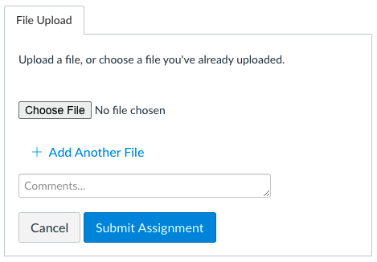

# Git Lab

In this Lab, you will need to perform a number of operations through the `git` program. You'll need to copy and paste the output you receive from each command.

## Instructions

### Downloading this Lab

1. From the repository homepage on GitHub, click the green "Code" button. Then, click "Download ZIP".

1. Unzip the downloaded file. This can be done by double clicking on the folder that was downloaded to your `Downloads/` folder. It will create a folder of the same name in your Downloads folder.

1. Navigate to the folder and open it with VSCode. Then, follow the instructions below.

### Completing this Lab

Complete each of the tasks in the [my-solution.md](./my-solution.md). For each task, you will be asked to copy and paste something into that file.

### Submitting the Lab

To submit the Lab on Canvas, you will need to upload the file from your computer to Canvas. After clicking the "Start Assignment" button, you should see a place to upload a file.

You only need to upload the `my-solution.md` file. You should not need to upload any other files.

Reach out to an instructor if you need help.
